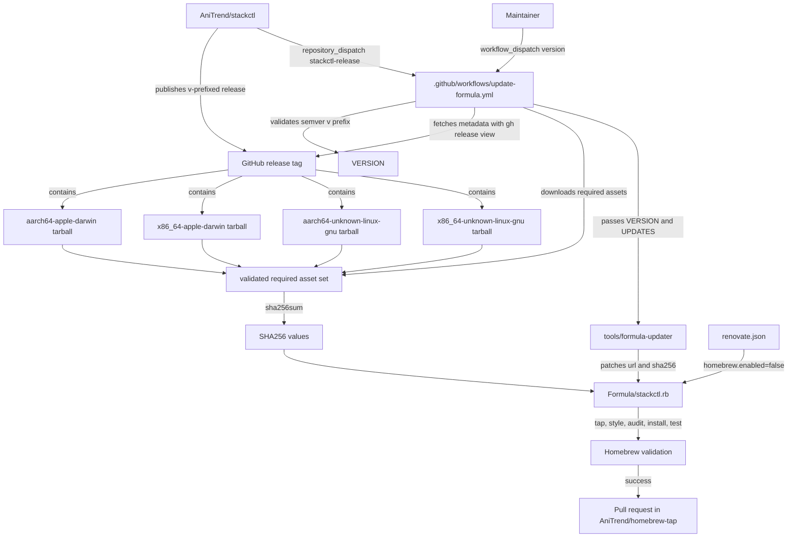
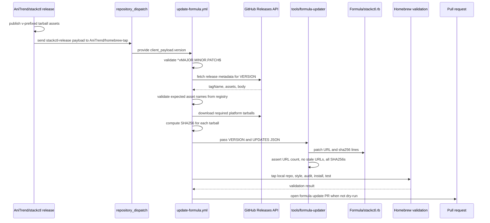
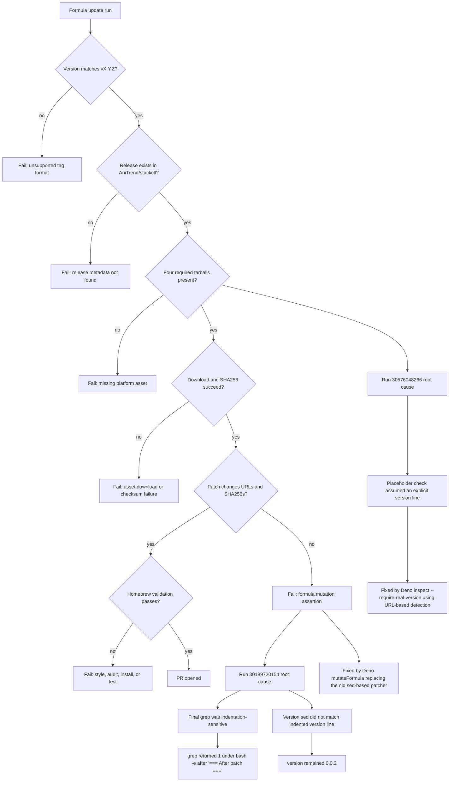

# stackctl formula update flow

This document maps how a stackctl release becomes a pinned Homebrew formula update in this tap. Treat the flow as a knowledge graph: releases produce assets, the workflow verifies them, the formula records immutable URLs and SHA256 values, and a pull request carries the mutation into `main`.

## Ownership

| Item | Owner | Source of truth |
| --- | --- | --- |
| Release tag | `AniTrend/stackctl` release workflow | GitHub release tag, for example `v0.1.0` |
| Release assets | `AniTrend/stackctl` release workflow | Four `stackctl-${VERSION}-${TARGET}.tar.gz` assets |
| Formula version | Homebrew | Inferred from stackctl release URLs in `Formula/stackctl.rb` |
| Formula URLs | `tools/formula-updater/` | GitHub release asset URLs from workflow `UPDATES` JSON |
| Formula SHA256 values | `tools/formula-updater/` | SHA256 values from workflow `UPDATES` JSON |
| Dependency bot behavior | `renovate.json` | `homebrew.enabled=false`, so Renovate does not update `Formula/stackctl.rb` |

`update-formula.yml` owns orchestration for pinned stackctl release updates. `tools/formula-updater/` now owns formula mutation from the workflow `UPDATES` contract. Renovate owns supported dependency managers only, and explicitly does not own the Homebrew formula manager for this repository.

## Knowledge graph



## Update sequence



## Test and verification pattern

1. **Unit tests**: `deno task test` runs 39 tests covering version detection, asset validation, formula mutation, and CLI commands. These tests use fixtures only. No network or Homebrew is required.
2. **Local simulation**: `deno task cli simulate --release tests/fixtures/stackctl/release.v0.2.1.json --formula tests/fixtures/stackctl/formula.before.rb` runs the full pure-logic pipeline in memory. This supports a build, test, simulate, repeat loop during local development.
3. **CI acid test**: `.github/workflows/updater-ci.yml` includes a `simulate` job that runs `simulate`, `inspect`, and `validate-release` against fixtures on every relevant pull request.
4. **Workflow dry-run**: `update-formula.yml` with `dry-run: true` runs patch, style, and audit validation without install, test, push, or pull request side effects.
5. **Full workflow**: `update-formula.yml` with `dry-run: false` performs the complete release update including install, test, push, and pull request creation.

## Asset contract

`update-formula.yml` requires these release targets for a version like `v0.1.0`:

| Target | Asset name |
| --- | --- |
| macOS ARM64 | `stackctl-v0.1.0-aarch64-apple-darwin.tar.gz` |
| macOS Intel | `stackctl-v0.1.0-x86_64-apple-darwin.tar.gz` |
| Linux ARM64 | `stackctl-v0.1.0-aarch64-unknown-linux-gnu.tar.gz` |
| Linux x86_64 | `stackctl-v0.1.0-x86_64-unknown-linux-gnu.tar.gz` |

Extra release assets are allowed. The workflow downloads each required tarball, computes its SHA256 locally, then writes the release URL and checksum into the matching platform block in `Formula/stackctl.rb`.

## Formula mutation contract

The patch step updates these formula fields only:

- Each `url "..."` receives a `https://github.com/AniTrend/stackctl/releases/download/${VERSION}/...` URL.
- Each following `sha256 "..."` receives the checksum computed from the downloaded tarball.

The formula does not write an explicit `version "..."` line. Homebrew infers the stable version from the release URLs.

Post-patch assertions then check:

- No stackctl release URL points at a stale version.
- Exactly four release URLs point at the target version.
- Every computed SHA256 exists in `Formula/stackctl.rb`.

## Updater status

`tools/formula-updater/` contains a registry-driven Deno updater for stackctl formula metadata. The live `.github/workflows/update-formula.yml` workflow now calls it for these key commands:

- `inspect`: URL-based version detection for `Formula/stackctl.rb`. This replaces the old bash placeholder check that assumed an explicit `version` line.
- `simulate`: full pipeline simulation in memory using release and formula fixtures. This is used for local testing and the CI acid test.
- `validate-release`: registry-driven asset name validation. This replaces the old hardcoded `EXPECTED_ARCHS` array in the workflow.
- `update`: formula mutation from workflow-provided `UPDATES` JSON.

Release lookup, asset download, checksum generation, pull request creation, and Homebrew validation still remain in GitHub Actions. Homebrew style, audit, install, and test checks remain Actions-owned validation gates.

## Failure-mode graph



## Run 30189720154 note

Run `30189720154` failed in the patch formula step after `=== After patch ===`. The final grep only matched unindented `version`, `url`, and `sha256` lines. `Formula/stackctl.rb` indents those lines, so grep returned `1` under `bash -e`.

The same indentation assumption affected the version `sed` expression when the formula still wrote an explicit version line. The updater now leaves the version inferred from URLs and keeps post-patch assertions so future failures stop at the exact broken contract.

## Run 30576048266 note

Run `30576048266` failed in the placeholder verification step because the workflow assumed `Formula/stackctl.rb` contained an explicit `version` line. The formula now infers version from release URLs only, so `grep` returned `1` and the step failed under `bash -e`.

That check now uses `deno task cli inspect --formula-path ../../Formula/stackctl.rb --require-real-version`, which detects the current version from stackctl release URLs and rejects the placeholder `v0.0.0` state without relying on a `version` line.

## Known validation risks

These risks occur after formula mutation and can still fail a run even when release URLs and SHA256 values are correct:

- `brew style Formula/stackctl.rb` can fail on Ruby formula style.
- `brew audit --strict --online stackctl` can fail on Homebrew policy or network-sensitive checks.
- `brew install --formula Formula/stackctl.rb` can fail if an asset is malformed, unreachable, or incompatible with the runner.
- `brew test stackctl` can fail if the binary behavior, embedded version string, or runtime dependencies differ from the formula test expectations.

These risks can occur before release lookup or before PR creation:

- Cross-repository token permissions can fail before release lookup or before PR creation if the GitHub App is not installed on both repositories with required read and write permissions.

## Manual trigger

Maintainers can run the same workflow manually when needed:

```bash
# Dry-run (default): validates without creating a PR or installing
gh workflow run update-formula.yml \
  --repo AniTrend/homebrew-tap \
  -f version=v0.2.1

# Full run: creates a PR after validation
gh workflow run update-formula.yml \
  --repo AniTrend/homebrew-tap \
  -f version=v0.2.1 \
  -f dry-run=false
```
